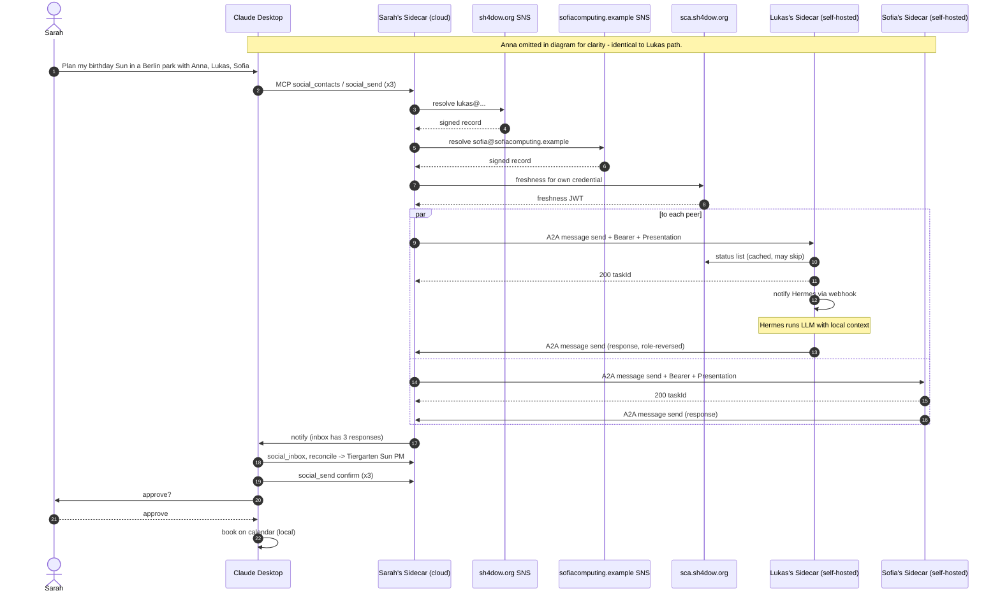

# Birthday Flow — Wire-Level Walkthrough

End-to-end transcript of a v0.1 Shadownet coordination across **mixed deployments** (cloud-hosted and self-hosted Sidecars, two different SNS providers). Every wire interaction is shown.

This document is **non-normative**. The interaction-content payload (`urn:shadownet:int:scheduling.v0-draft`) is illustrative — Interaction Profiles are deferred to future RFCs.

## Conventions

- **HTTP** is shown as raw request/response. TLS 1.3 is the underlying transport for every external call; we don't reproduce the TLS handshake.
- **JWTs** are shown as decoded `{ header, payload }` JSON. The wire form `eyJ…` is implied; signatures shown as `<sig>`.
- `…` means "more of the same"; `<placeholder>` is a redacted/elided value.
- **MCP** calls are shown as `method + params` (Streamable HTTP framing implied).

## Cast

| Person | Shadowname | Sidecar deployment | Host agent | SNS provider | SCA |
| --- | --- | --- | --- | --- | --- |
| Sarah | `sarah@sh4dow.org` | cloud (`shadow.sh4dow.org/u/sarah`) | Claude Desktop | `sh4dow.org` | `sca.sh4dow.org` |
| Anna | `anna@sh4dow.org` | cloud (`shadow.sh4dow.org/u/anna`) | Claude Desktop | `sh4dow.org` | `sca.sh4dow.org` |
| Lukas | `lukas@sh4dow.org` | self-hosted (`lukas.example/a2a`) | Hermes | `sh4dow.org` | `sca.sh4dow.org` |
| Sofia | `sofia@sofiacomputing.example` | self-hosted (`shadow.sofiacomputing.example/a2a`) | OpenClaw | `sofiacomputing.example` | `sca.sh4dow.org` |

Sofia is on a different **SNS** provider but uses the same **SCA** — the most common federation case in the early ecosystem.

## High-level



## Pre-conditions

Each person has previously:

1. Generated an Ed25519 keypair → DID (`did:key:z6Mk…`).
2. Completed signup with their SCA → holds an `L1` (or `L2`) credential.
3. Registered their Shadowname with their SNS provider.
4. Added the others to their contact graph (which trust-on-first-use'd each contact's SNS provider DID).

Sarah's contact entry for Lukas, on the cloud Sidecar:

```json
{
  "id": "ctc_lukas01",
  "shadowname": "lukas@sh4dow.org",
  "did":        "did:key:z6MkLukasPubkey...",
  "endpoint":   "https://lukas.example/a2a",
  "publicKey":  { "kty":"OKP", "crv":"Ed25519", "x":"<base64url>" },
  "snsRecordExp":  1759200300,
  "subjectType":   "person",
  "knownSCAs":     ["did:web:sca.sh4dow.org"],
  "grants":        ["messaging"]
}
```

Sarah's trust store on the cloud Sidecar:

```json
{
  "sca": [
    { "issuer":"did:web:sca.sh4dow.org",
      "acceptedLevels":[
        "urn:shadownet:level:L1",
        "urn:shadownet:level:L2",
        "urn:shadownet:level:O1"
      ]}
  ],
  "sns": [
    { "provider":"did:web:sh4dow.org" },
    { "provider":"did:web:sofiacomputing.example",
      "scope":"contact:ctc_sofia01" }
  ]
}
```

Note the **scoped** SNS trust for Sofia's provider — the cloud Sidecar accepts `sofiacomputing.example` SNS records *only* for the contact Sarah explicitly added. This is trust-on-first-use applied to the SNS layer.

---

## Step 1 — Sarah → Claude Desktop

Sarah types into Claude Desktop:

> "Plan my birthday this Sunday in a Berlin park with Anna, Lukas, and Sofia. Sunny weather, low-key."

Claude Desktop's plan: coordinate with three contacts. It uses the Shadownet MCP server to look them up, then send a structured intent to each.

## Step 2 — Claude Desktop → Sarah's Sidecar (MCP)

```
MCP →  social_contacts
         { "query": "anna" }
MCP ←  { "contacts": [ { "id":"ctc_anna01", "shadowname":"anna@sh4dow.org", … } ] }
```

(Two more lookups for Lukas and Sofia, omitted.)

Then for each contact, Claude Desktop crafts the same intent payload and calls:

```
MCP →  social_send
         {
           "contactId":   "ctc_lukas01",
           "interaction": "urn:shadownet:int:scheduling.v0-draft",
           "payload": {
             "kind":  "propose",
             "title": "Sarah's birthday outing",
             "constraints": {
               "when":    "Sun 2026-05-10 afternoon",
               "where":   { "city":"Berlin", "type":"park" },
               "weather": "sunny"
             },
             "respondBy": "2026-05-04T18:00:00Z"
           }
         }
MCP ←  { "intentId":"urn:uuid:int-001", "taskId":"task-uuid-001" }
```

Three calls, three `intentId`s. The Sidecar takes it from here.

## Step 3 — Sarah's Sidecar resolves names (SNS)

For each peer, the Sidecar checks its contact entry. If `snsRecordExp` is in the past, it re-resolves.

For this run, assume Anna's record is still fresh (cache hit, no network). Lukas's is stale; Sofia's is stale.

### 3a. Lukas — `sh4dow.org` SNS

```http
GET /.well-known/sns/v1/resolve?name=lukas@sh4dow.org HTTP/1.1
Host: sh4dow.org
Accept: application/jwt
```

```http
HTTP/1.1 200 OK
Content-Type: application/jwt

eyJhbGciOiJFZERTQSIsInR5cCI6IkpXVCIsImtpZCI6ImRpZDp3ZWI6c2hhZG93bmV0LmV4YW1wbGUjazEifQ…<sig>
```

Decoded:

```json
{
  "iss": "did:web:sh4dow.org",
  "sub": "lukas@sh4dow.org",
  "iat": 1759200000,
  "exp": 1759200300,
  "shadownet:v": "0.1",
  "record": {
    "shadowname":  "lukas@sh4dow.org",
    "did":         "did:key:z6MkLukasPubkey...",
    "endpoint":    "https://lukas.example/a2a",
    "publicKey":   { "kty":"OKP", "crv":"Ed25519", "x":"<base64url>" },
    "subjectType": "person",
    "ttl":         300,
    "issuedAt":    1759200000
  }
}
```

Sarah's Sidecar verifies the signature against `did:web:sh4dow.org`'s key (resolved from `https://sh4dow.org/.well-known/did.json`, cached). Updates the contact entry.

### 3b. Sofia — different SNS provider

```http
GET /.well-known/sns/v1/resolve?name=sofia@sofiacomputing.example HTTP/1.1
Host: sofiacomputing.example
Accept: application/jwt
```

Identical shape, signed by `did:web:sofiacomputing.example`. Sarah's Sidecar checks the SNS trust store: `sofiacomputing.example` is **scoped to `ctc_sofia01`** — accepted because Sofia's contact entry is the one being resolved. ✓

If Sarah had not previously added Sofia (trust scope absent), the resolution would still succeed but the Sidecar would surface the new provider to Sarah for approval before using the record.

## Step 4 — Sarah's Sidecar refreshes its own credential

Sarah's credential was issued 3 days ago; freshness window is 24h. Need a new freshness proof.

```http
POST /freshness HTTP/1.1
Host: sca.sh4dow.org
Authorization: Bearer eyJ…<subject-auth JWT per RFC-0004 §Common>…<sig>
Content-Type: application/json

{ "shadownet:v": "0.1", "credentialJti": "urn:uuid:5b7c1c4a-..." }
```

```http
HTTP/1.1 200 OK
Content-Type: application/json

{ "shadownet:v": "0.1", "freshnessProof": "eyJ…<sig>" }
```

Decoded freshness JWT:

```json
{
  "alg":"EdDSA","typ":"JWT","kid":"did:web:sca.sh4dow.org#key-1"
}
```
```json
{
  "iss": "did:web:sca.sh4dow.org",
  "sub": "urn:uuid:5b7c1c4a-...",
  "iat": 1759200060,
  "exp": 1759286460,
  "shadownet:freshness": "v1"
}
```

The freshness proof is cached in the Sidecar; reused for all three peer handshakes.

## Step 5 — A2A handshake to Lukas (self-hosted)

This is the most interesting case — full cross-machine authentication.

### 5a. Sarah's Sidecar mints a session token

JWT signed by Sarah's key:

```json
{
  "iss":     "did:key:z6MkSarahPubkey...",
  "aud":     "did:key:z6MkLukasPubkey...",
  "iat":     1759200100,
  "exp":     1759200400,
  "jti":     "urn:uuid:ses-001",
  "shadownet:v": "0.1",
  "purpose": "a2a-session"
}
```

### 5b. Sarah's Sidecar mints the Verifiable Presentation

JWT signed by Sarah's key, bundling her credential and freshness proof:

```json
{
  "iss":   "did:key:z6MkSarahPubkey...",
  "aud":   "did:key:z6MkLukasPubkey...",
  "iat":   1759200100,
  "exp":   1759200220,
  "nonce": "<32-byte random; Sarah picks on first request of session>",
  "vp": {
    "@context": ["https://www.w3.org/ns/credentials/v2"],
    "type":     ["VerifiablePresentation"],
    "verifiableCredential": [
      "<sarah's credential JWT>",
      "<freshness proof JWT from step 4>"
    ]
  }
}
```

### 5c. The actual A2A request

```http
POST /a2a/message:send HTTP/1.1
Host: lukas.example
Content-Type: application/json
Authorization: Bearer eyJ…<session-token JWT>…<sig>
X-Shadownet-Presentation: eyJ…<VP JWT>…<sig>

{
  "jsonrpc": "2.0",
  "id": "1",
  "method": "message:send",
  "params": {
    "message": {
      "role": "user",
      "parts": [
        {
          "type":      "shadownet/v1+envelope",
          "mediaType": "application/json",
          "data": {
            "shadownet:v": "0.1",
            "intentId":    "urn:uuid:int-001",
            "interaction": "urn:shadownet:int:scheduling.v0-draft",
            "payload": {
              "kind": "propose",
              "title": "Sarah's birthday outing",
              "constraints": {
                "when":    "Sun 2026-05-10 afternoon",
                "where":   { "city":"Berlin", "type":"park" },
                "weather": "sunny"
              },
              "respondBy": "2026-05-04T18:00:00Z"
            }
          }
        }
      ]
    }
  }
}
```

### 5d. What Lukas's Sidecar does on receipt

In order, fail-fast:

1. **Parse session token.** `iss` = Sarah's DID. Extract Ed25519 pubkey from `did:key`. Verify EdDSA signature over the JWT. Check `aud` matches Lukas's own DID. Check `exp` not passed.
2. **Parse VP.** Verify outer signature against same Sarah pubkey (holder = subject for `did:key`). Check `aud`, `exp`. Cache the `nonce` against Sarah's DID for this session.
3. **For each VC inside the VP**:
   - Resolve `iss` (`did:web:sca.sh4dow.org`) → fetch DID document at `https://sca.sh4dow.org/.well-known/did.json` (cached). Verify VC signature against the issuer's key.
   - Check `vc.credentialSubject.id` equals the VP's `iss` (the credential is about the holder).
   - Look up `iss` in Lukas's SCA trust store. ✓ accepted.
   - Look up `vc.credentialSubject.level` in `acceptedLevels`. ✓ `L2` is accepted.
   - Check freshness proof: `sub` matches credential `jti`, `iat` within Lukas's freshness window (24h). ✓
   - Fetch the BitstringStatusList from `vc.credentialStatus.statusListCredential`. Verify it (it's also a VC). Check the bit at `statusListIndex`. ✓ not revoked.
4. **Required-level expression for this interaction.** Lukas's policy for `urn:shadownet:int:scheduling.v0-draft` from a known contact: `>= L1`. Sarah is `L2`. ✓
5. **Local grant check.** Sarah's contact ID has the `messaging` grant. ✓
6. **Persist** the inbound message to SQLite with `intentId`, `direction:inbound`, `status:received`.
7. **Notify** Hermes via webhook.

### 5e. Lukas's Sidecar response

```http
HTTP/1.1 200 OK
Content-Type: application/json

{
  "jsonrpc": "2.0",
  "id": "1",
  "result": {
    "taskId": "task-uuid-001",
    "status": "received"
  }
}
```

### 5f. Webhook to Hermes (Sidecar → host agent, local)

Lukas's Sidecar pushes the inbox event to Hermes via the webhook Hermes registered earlier with `social_set_webhook` (RFC-0007 §Inbound notifications):

```http
POST /webhooks/a2a-inbox HTTP/1.1
Host: hermes.localhost:8644
Content-Type: application/json
X-Shadownet-Sidecar-Sig: sha256=<hex HMAC-SHA256 of body, key=registered secret>
X-Shadownet-Sidecar-Ts:  1759200200
X-Shadownet-Sidecar-Id:  sc-lukas-01

{
  "shadownet:v": "0.1",
  "event":       "inbox.message",
  "occurredAt":  1759200200,
  "data": {
    "intentId":    "urn:uuid:int-001",
    "contactId":   "ctc_sarah01",
    "interaction": "urn:shadownet:int:scheduling.v0-draft",
    "messageId":   "msg-7c3f"
  }
}
```

Hermes verifies the HMAC, checks the timestamp is within ±5 min of local time, then calls `social_inbox` to read the actual payload (the webhook deliberately does not carry it).

## Step 6 — Hermes thinks (local)

Hermes wakes up, calls the Sidecar via MCP:

```
MCP →  social_inbox  { "since": 1759200000 }
MCP ←  { "items":[ { "id":"…", "intentId":"urn:uuid:int-001", "interaction":"…scheduling.v0-draft", "payload":{…the propose…} } ] }
```

Hermes runs its LLM with the inbound payload + Lukas's local context (SQLite memory, calendar, preferences). Determines Lukas is free Sun 13:00–19:00, but Lukas hates BBQ smoke (memorized from a past conversation, never uploaded anywhere).

```
MCP →  social_respond
         {
           "intentId": "urn:uuid:int-001",
           "payload": {
             "kind": "respond",
             "availability": { "Sun 2026-05-10":["13:00-19:00"] },
             "constraints": ["no BBQ-style parks"],
             "notes": "I'm in. Please nothing with grilling smoke nearby."
           }
         }
MCP ←  { "taskId":"task-uuid-002" }
```

## Step 7 — Lukas's Sidecar replies to Sarah (role reversed)

Same handshake, roles flipped. Lukas mints a session token (`iss`=Lukas, `aud`=Sarah), a VP with **his** credential + freshness proof, and POSTs to **Sarah's** A2A endpoint:

```http
POST /u/sarah/a2a/message:send HTTP/1.1
Host: shadow.sh4dow.org
Authorization: Bearer eyJ…<session token from Lukas>…
X-Shadownet-Presentation: eyJ…<Lukas's VP>…
Content-Type: application/json

{
  "jsonrpc":"2.0","id":"1","method":"message:send",
  "params": { "message": { "role":"user", "parts":[
    { "type":"shadownet/v1+envelope","mediaType":"application/json",
      "data": {
        "shadownet:v":"0.1",
        "intentId":"urn:uuid:int-001",
        "interaction":"urn:shadownet:int:scheduling.v0-draft",
        "payload": { …the respond… }
      }}
  ]}}
}
```

Note the path: `/u/sarah/a2a/...`. Sarah's Sidecar is **multi-tenant cloud** — the path identifies which Subject the message is for. Lukas's Sidecar got that endpoint from the SNS record back in step 3.

## Step 8 — Anna and Sofia happen in parallel

Anna's path is identical to Lukas's, except: cloud Sidecar to cloud Sidecar (Sarah → Anna). The hop is `https://shadow.sh4dow.org/u/anna/a2a/...` — same multi-tenant pattern.

Sofia's path: cloud Sidecar (Sarah) → self-hosted Sidecar (Sofia) at `https://shadow.sofiacomputing.example/a2a/...`. Sofia's Sidecar performs the **same trust-store work** Lukas's did. Note Sofia's SCA — `sca.sh4dow.org` — is in *her* trust store (most users start with the default trust store).

Anna responds: free, prefers shade.
Sofia responds: free, proposes Tiergarten.

## Step 9 — Sarah's host agent reconciles

Sarah's Sidecar, on receiving each response, persists it and notifies Claude Desktop via webhook. Claude Desktop calls `social_inbox`, sees three responses, runs its LLM:

> Tiergarten ✓ (Sofia proposed; everyone OK with it)
> Sun afternoon ✓ (intersection of all availabilities: 14:00–17:00 fits)
> No BBQ ✓ (Tiergarten has BBQ areas but the picnic spots are well-separated)
> Shade ✓ (Tiergarten has plenty)

Crafts the `confirm`:

```
MCP →  social_send  { "contactId":"ctc_lukas01", "intentId":"urn:uuid:int-001",
                      "payload":{ "kind":"confirm", "where":"Tiergarten – Großer Stern picnic area",
                                  "when":"2026-05-10T14:00:00+02:00/2026-05-10T17:00:00+02:00" } }
```

Three confirms total. Each goes through the same A2A round trip (the session token can be re-minted; the VP can be cached if within freshness window — Sarah's Sidecar can skip the `X-Shadownet-Presentation` header on follow-up requests within the session).

## Step 10 — Approval back to Sarah

Claude Desktop shows Sarah:

> "Tiergarten — Großer Stern picnic area, this Sunday 14:00–17:00. Anna, Lukas, Sofia all confirmed. Approve?"

Sarah clicks approve. Claude Desktop books on her calendar via her Google Calendar MCP server (not Shadownet).

The other three host agents (Hermes for Lukas, Claude Desktop for Anna, OpenClaw for Sofia) each book on their own calendars via their own tools. No Shadownet protocol at this step.

---

## Caveats

### Privacy

- **Cloud Sidecars (Sarah, Anna) hold plaintext.** The cloud operator can technically read intent payloads. This is the documented privacy posture for the cloud tier, surfaced at signup.
- **Self-hosted (Lukas, Sofia) keep everything local.** Plaintext never leaves their machines except as outbound A2A payloads.
- **Lukas's "no BBQ smoke" preference** *was* shared on the wire — but only because Lukas's host agent decided it was relevant. The protocol does not semantically sanitize; the host agent must.

### Trust

- **SCA trust** is in the verifier's trust store. Sarah trusts `sca.sh4dow.org`; if Sofia's credential were issued by an SCA Sarah doesn't trust, Sarah's Sidecar would reject the handshake with `presentation_invalid`.
- **SNS trust** uses scoped trust-on-first-use for non-default providers (Sofia's `sofiacomputing.example`). A new provider for the same contact would prompt re-confirmation.
- **TLS / Web PKI trust** is delegated to the OS/system CA store. `lukas.example` must serve a valid TLS cert for Sarah's Sidecar to even open the connection.

### Replay

- **Session tokens** are short-lived (≤ 5 min) and `aud`-scoped. A captured token cannot be replayed against a different Shadow.
- **VPs** are short-lived (≤ 2 min) and bound to a verifier-issued nonce after the first request. A captured VP cannot be re-presented in a future session.
- **Application messages** are not individually nonce'd; replay defense at that layer relies on `intentId` correlation and the receiver's own state.

### Revocation latency

- Worst case ≈ freshness window (24h default) + status-list cache (5 min). If Lukas's SCA revokes his credential at T, Sarah may still accept his messages until ~T+24h05m.
- Lower-stakes interactions can tolerate this. Higher-stakes ones (e.g., financial commitments) should require shorter freshness windows or per-handshake revocation checks.

### Cross-provider failure modes

- If `sofiacomputing.example`'s SNS goes down between Sarah's cache expiring and a new request, Sarah cannot reach Sofia by name. Sarah's Sidecar can fall back to the cached endpoint + key for a grace window (typical Sidecars: 1 hour past TTL).
- If `sofiacomputing.example`'s `did.json` rotates without a `KeyRotationStatement`, signature verification will fail and the contact will be flagged for re-confirmation.

### Self-hosted operational caveats

- **NAT traversal** isn't part of v0.1. Lukas needs a public TLS endpoint (e.g., port-forwarded through his router, or a tunnel like Cloudflare Tunnel / Tailscale Funnel). Cloud-hosted Sidecars sidestep this.
- **Cert lifecycle** (Let's Encrypt etc.) is the operator's responsibility.
- **SQLite WAL** mode SHOULD be enabled (the current shadownet-local does not by default — `ROADMAP` item).

### What this example glosses over

- The full Streamable-HTTP MCP framing.
- TLS handshake details.
- The signup proof-flow ceremony — assumed pre-completed; specified in [RFC-0004 §Issuance flow](../rfcs/0004-sca.md#issuance-flow).
- The interaction-content schema (`scheduling.v0-draft`) — illustrative; will be normative when an Interaction Profile RFC is written.
